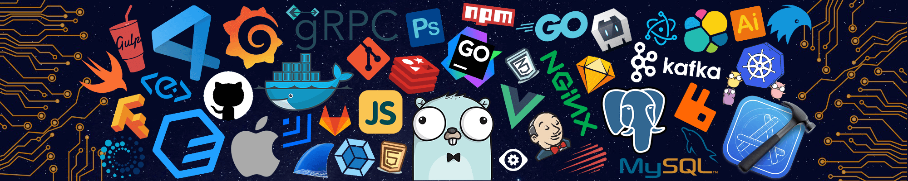

<h1 align="center" class="heading-element" dir="auto">Hi 👋, I'm Hosein Dostalivand Nezhad</h1>

- 🖥️ See my portfolio at <a href="https://github.com/Hosein-DAV" rel="nofollow">GitHub.com</a>

- 🚀 I will start working <a href="#" rel="nofollow">soon ...</a>  

- 🤝 I'm open to collaborating on interesting projects a web developer.  

<a class= "headding-Link" href="#Skills"><h2>Skills</h2>

        
## 📊 GitHub Stats:

<a class= "headding-Link" href="#social"><h2>Social</h2>

